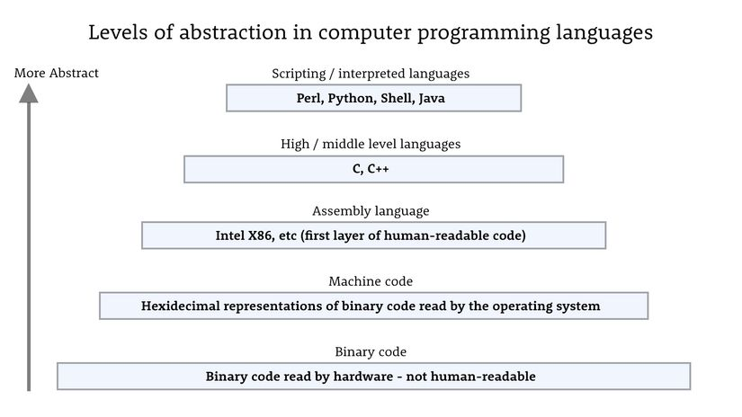

## Python for Bankers

#### Using programming to supercharge your day

----

### Who is this for? 

You, if: 

* Your available tools are limited to Excel + Powerpoint, but you want something more powerful
* You've heard that Python is basically the coolest thing since the Chipotle burrito
* You studied computer science, engineering, math...or philosophy, Spanish, or pre-law...or didn't go to college. Really, as long as you want to learn to code, you can

----
### What we want to cover:
* What is programming? Is this for me? 
* What is programming used for? I'm not planning on becoming a software developer
* Why are there different programming languages and why are we talking about Python?
* A minimal overview of the language itself, but just to understand what the foundational concepts are. For syntax and more, Google is your friend
* (Most of our time) Walking through some real world examples of writing code to get data, transform data, and do analysis
----
### Topics:
1. What is programming? Is this for me? 
2. A minute on VBA 
3. The Python story
4. Python language basics
5. Use cases
    1. Working with data from Yahoo finance/Cool graphs
    2. Data feeds from APIs: Quandl
    3. Web scraping/Information Retrieval
    4. Basic Machine Learning: Handwritten digit recognition
----
#### What is programming? Is this for me? 

* Tell the computer what to do, and how. 
* The closer you get to the physical hardware, the more power you have but that comes with complexity

 <!-- .element height="60%" width="60%" -->

src: https://techblog.vn/everything-you-should-know-when-design-a-domain-specific-language-pt-3-dsl-design-strategies

----
#### What types of tasks involve programming?
* Software development: Creating the Google search engine, Youtube, Microsoft Excel, quant trading systems, instagram, iOS and more
* Software sometimes has a visual component (websites, apps, GUIs). Sometimes is very math heavy (data science, machine learning). Sometimes is very process driven (an order flow system at a bank)
* Programming doesn't always mean building full fledged software. Sometimes programming is used to do a small task quickly ("scripting")

----
#### Some examples of when "scripting" is handy
* "I want to rename 5000 files in a folder based on certain criteria"
* "I have a list of hundreds of files I need to download from a website"
* "I need to scan through these 100 text files and pull out each email address"
* "I need to process a directory of CSV files and restructure the data and add a few new processed columns but its too big for Excel"
* "I want to process these data sets and automatically create time series charts and save them to a folder"
----
#### What will I learn
As you progress, you'll learn how a computer works and how it interacts with other computers
* How do I interact with my filesystem and operating system? What is the difference between the hard drive and memory?
* How do I make requests over a network? What are protocols? How does the internet work?
* Why are data stored in different file formats? How do I process those? 
* How do I interact with other programs (e.g. a browser)? 
----

#### Why so many languages

* C and C++ take far longer to learn, but you can create an entire operating system or write a graphics driver
* With Java or C++ you might create a low latency trading system
* With Python you can analyze data, do machine learning, create charts, interact with web browsers, and more

----
#### An example of an http request (getting a website)
First, in C:
```
// Src: https://stackoverflow.com/questions/22077802/simple-c-example-of-doing-an-http-post-and-consuming-the-response
#include <stdio.h> /* printf, sprintf */
#include <stdlib.h> /* exit */
#include <unistd.h> /* read, write, close */
#include <string.h> /* memcpy, memset */
#include <sys/socket.h> /* socket, connect */
#include <netinet/in.h> /* struct sockaddr_in, struct sockaddr */
#include <netdb.h> /* struct hostent, gethostbyname */

void error(const char *msg) { perror(msg); exit(0); }

int main(int argc,char *argv[])
{
    /* first what are we going to send and where are we going to send it? */
    int portno =        80;
    char *host =        "api.somesite.com";
    char *message_fmt = "POST /apikey=%s&command=%s HTTP/1.0\r\n\r\n";

    struct hostent *server;
    struct sockaddr_in serv_addr;
    int sockfd, bytes, sent, received, total;
    char message[1024],response[4096];

    if (argc < 3) { puts("Parameters: <apikey> <command>"); exit(0); }

    /* fill in the parameters */
    sprintf(message,message_fmt,argv[1],argv[2]);
    printf("Request:\n%s\n",message);

    /* create the socket */
    sockfd = socket(AF_INET, SOCK_STREAM, 0);
    if (sockfd < 0) error("ERROR opening socket");

    /* lookup the ip address */
    server = gethostbyname(host);
    if (server == NULL) error("ERROR, no such host");

    /* fill in the structure */
    memset(&serv_addr,0,sizeof(serv_addr));
    serv_addr.sin_family = AF_INET;
    serv_addr.sin_port = htons(portno);
    memcpy(&serv_addr.sin_addr.s_addr,server->h_addr,server->h_length);

    /* connect the socket */
    if (connect(sockfd,(struct sockaddr *)&serv_addr,sizeof(serv_addr)) < 0)
        error("ERROR connecting");

    /* send the request */
    total = strlen(message);
    sent = 0;
    do {
        bytes = write(sockfd,message+sent,total-sent);
        if (bytes < 0)
            error("ERROR writing message to socket");
        if (bytes == 0)
            break;
        sent+=bytes;
    } while (sent < total);

    /* receive the response */
    memset(response,0,sizeof(response));
    total = sizeof(response)-1;
    received = 0;
    do {
        bytes = read(sockfd,response+received,total-received);
        if (bytes < 0)
            error("ERROR reading response from socket");
        if (bytes == 0)
            break;
        received+=bytes;
    } while (received < total);

    if (received == total)
        error("ERROR storing complete response from socket");

    /* close the socket */
    close(sockfd);

    /* process response */
    printf("Response:\n%s\n",response);

    return 0;
}
```

----
#### And in Python
```
# src: https://stackoverflow.com/questions/11322430/how-to-send-post-request
import requests
r = requests.post("http://bugs.python.org", data={'number': 12524, 'type': 'issue', 'action': 'show'})
print(r.status_code, r.reason)
# 200 OK
print(r.text[:300] + '...')
```
----
#### Why?
* Python is actually written in C++, so it comes with many features (an `http` library in this case) that is implemented in a lower level language
* And Python has a rich community of contributors, who built an even nicer `requests` library on top of the `http` library

* Lesson: Python has limitations when you want to do really complex things but is *extremely* flexible to use, fast to learn, and handy for many different types of tasks
----

* And you can literally start programming on almost any modern computer. 

Search for "Dev Tools" in Chrome to write some javascript

----
If you have a Mac, look for "Terminal" in Applications. Python is installed on all Linux operating systems (and therefore on Macs as well)

 <!-- .element height="80%" width="80%" -->
----
### A minute on VBA
Visual Basic for Applications (VBA) is quite amazing within the context of Microsoft applications. There are many solid concepts from mainstream programming that lives in VBA. 

Bankers especially are notorious for squeezing everything possible out of VBA to automate workflows, analysis, chart creation, etc
----
### The good of VBA 
* Object oriented programming: All MS charts, cells, etc are objects with various attributes and other objects within. This is good
* For data, starting to think about using code to manipulate sequences of data, instead of dragging and button clicking
----
### The bad of VBA
* Tightly coupled to Microsoft apps. Hard to learn how code can be used in other contexts
* Not easy to develop, version control and test. Code is in Microsoft viewer in Excel/Powerpoint/Word. 
* (Important) When working with data, too often is data treated as unbounded arrays of data in Excel tables, with hard references to cells that can easily change ($B$5?)
----
### Move from this
 <!-- .element height="80%" width="80%" -->

----
### To this:
 <!-- .element height="70%" width="70%" -->


----
### The story of Python

https://en.wikipedia.org/wiki/Python_(programming_language)

----
### A few details
* Easy to learn syntax: Has created massive community of new programmers
* "Batteries included": Very big standard library to get lots of things done quickly
* Huge contributor community: There is a python package for just about anything

----
### The community
 <!-- .element height="50%" width="50%" -->

----
### Is there an app to interact with Robinhood?


----
### Python owns the numerical computing stack
* Pandas: Dataframes, time series, slicing/dicing data
* Numpy/Scipy: Math/Stats
* Scikit-learn: Machine Learning
* Tensorflow/PyTorch/Keras: Deep Learning/Deep Neural Nets on GPUs

----
### The future (in 2012)
<iframe title="New York Times Video - Embed Player" width="960" height="640" frameborder="0" scrolling="no" allowfullscreen="true" marginheight="0" marginwidth="0" id="nyt_video_player" src="https://www.nytimes.com/video/players/offsite/index.html?videoId=100000001629221"></iframe>

----
### Down to business
----
### Python basics: How to run

Mac/Linux:
```
$ python3
Python 3.7.3 (v3.7.3:ef4ec6ed12, Mar 25 2019, 16:52:21) 
[Clang 6.0 (clang-600.0.57)] on darwin
Type "help", "copyright", "credits" or "license" for more information.
>>> print("hello world")
hello world
>>> 
```
----
#### Running on Windows (probably your case)
The awesome folks at anaconda.com have a Python distribution that includes Python itself, a large number of common packages you'll most likely need, as well as a shell for Windows. 

Download the Anaconda distribution and open the "Anaconda prompt"
```
(base) C:\>python
Python 3.7.0 (default, June 2018, 08:04:48) [MSC v.1912 64bit (AMD64)] :: Anaconda, Inc. on win32
Type "help", "copyright", "credits" or "license" for more information.
>>> print("hello world")
hello world
>>> 
```
----
#### Python basic syntax

* Basic types: `str`, `int`, `float`, `bool`, `list`, `set`, `dict`
* Functions: `def`
* Classes: `class`


#### Basic types

```
>>> a = 1
>>> b = 3
>>> type(a)
'<class 'int'>
>>> a+b
4
>>> a/b
0.3333333333333333
```


#### Strings
```
>>> test_string = 'Hello World'
>>> len(test_string)
11
>>> test_string.upper()
'HELLO WORLD'
>>> test_string.lower()
'hello world'
>>> test_string.replace('World', 'Galaxy')
'Hello Galaxy'
```


#### Cooler things with strings: Pattern matching

Find all the phone numbers in this text: 

> Please contact me at my office number (212-111-0909) 
or call my cell at 101-093-6543. 
If you can't reach those, 
call my manager at 212-546-1123

Create a search pattern for these phone numbers and use python's `re` library (Regular Expression) to find all matching strings


```
>>> text = '''Please contact me at my office number (212-111-0909) 
or call my cell at 101-093-6543. If you can't reach those, 
call my manager at 212-546-1123'''
# triple quotes can be used for multiline strings...
# this is a comment btw
>>> import re
>>> re.findall(r'\d{3}\-\d{3}\-\d{4}', text)
['212-111-0909', '101-093-6543', '212-546-1123']

# \d{3}\-\d{3}\-\d{4} is our pattern
# \d{3} says to match 3 consecutive numbers
# \- matches a normal hyphen. A - is a special char, 
# hence the leading \
````


### The List!

```
>>> [0,1,2,3,4,5]
[0, 1, 2, 3, 4, 5]
>>> list(range(6))
[0, 1, 2, 3, 4, 5]
>>> [i for i in range(100) if i%17==0]
[0, 17, 34, 51, 68, 85]
>>> 'strings can be split into lists of other strings'.split()
['strings', 'can', 'be', 'split', 'into', 'lists', 'of', 'other', 'strings']

>>> my_list = [1,2,3]
>>> my_list.append(4)
>>> my_list
[1, 2, 3, 4]
```


### The Dictionary
* A `dict` is a mapping of keys to values (think of how you use vlookup, but way more powerful)

```
>>> tickers = {"ford": 'F', "google": "GOOGL", 
               "microsoft": "MSFT", "tesla": "TSLA"}
>>> tickers['ford']
'F'
>>> tickers['aol']
Traceback (most recent call last):
  File "<stdin>", line 1, in <module>
KeyError: 'aol'
>>> tickers.items()
dict_items([('ford', 'F'), ('google', 'GOOGL'), 
('microsoft', 'MSFT'), ('tesla', 'TSLA')])
```


### Manipulating data

Print tickers with price over $200

```
>>> prices = {"TSLA": 219, "MSFT": 134, "F": 9, "GOOGL": 1164}
>>> for ticker, price in prices.items():
        if price > 200:
            print(ticker)
TSLA
GOOGL
```
Ok, but not very "pythonic"


Better
```
>>> [name for name in prices if prices[name] > 200]
['TSLA', 'GOOGL']
```
Slightly more complex but also good
```
>>> list(filter(lambda name: prices[name] > 200, prices))
['TSLA', 'GOOGL']
```
